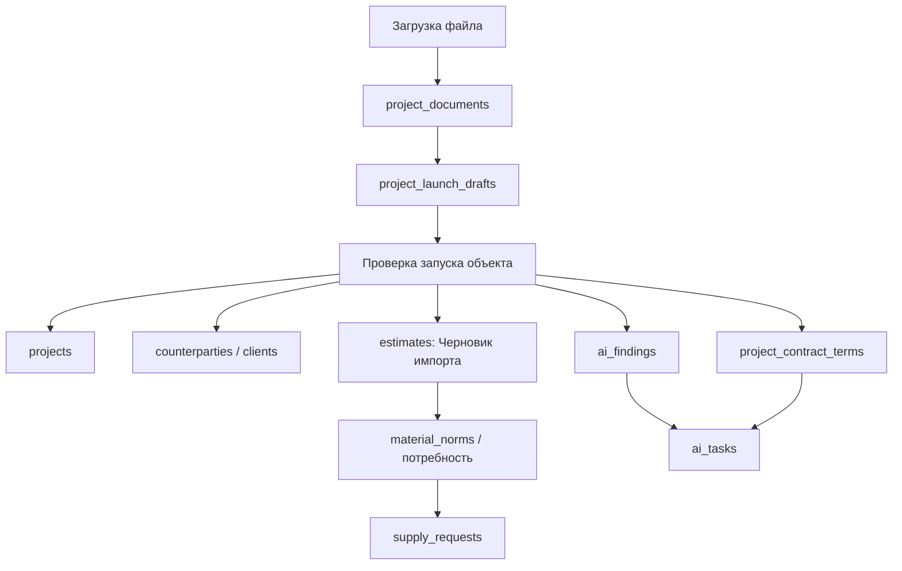

# Запуск объекта: отдельный AI-контур

## Цель

`Запуск объекта` - отдельный модуль для создания полной стартовой картины по объекту из документов: договоров, смет, ТЗ, счетов, реквизитов, фото и файлов.

Модуль не должен разрастаться внутри `App.js` и `backend/main.py`. Основная логика живет в:

- backend: `backend/features/project_launch/`
- frontend: `src/features/project-launch/`
- документация: `docs/project-launch-architecture.md`

В монолит допускаются только тонкие точки подключения: регистрация router, открытие панели в карточке проекта и вызовы существующих API.

## Главный принцип безопасности

ИИ ничего не проводит автоматически.

Документы и результаты распознавания идут по цепочке:

`файл -> документ объекта -> AI-черновик -> проверка человеком -> запись в рабочие сущности`

Пока пользователь не нажал `Применить`, данные не должны менять объект, смету, склад, финансы, договоры или доступы.

## Цепочка данных

## Что куда сохраняется

| Что нашли | Черновик | Рабочая запись после подтверждения |
|---|---|---|
| Оригинал файла | `project_documents.scan_url` | остается документом объекта |
| Тип документа, номер, дата, сумма | `project_launch_drafts.extracted_json` | `project_documents`, `project_contract_terms` |
| Заказчик/контрагент | `project_launch_drafts.extracted_json` | `counterparties` или `clients` |
| Бюджет, сроки, адрес, этажность | `project_launch_drafts.project_patch_json` | `projects` |
| Условия договора | `project_launch_drafts.contract_terms_json` | `project_contract_terms` |
| Сметные строки | `project_launch_drafts.estimate_draft_json` | `estimates` со статусом `Черновик импорта` |
| Юридические риски | `project_launch_drafts.findings_json` | `ai_findings` |
| Контрольные действия | `project_launch_drafts.tasks_json` | `ai_tasks` |

## Новые таблицы модуля

### `project_launch_drafts`

Черновик запуска объекта. Хранит результат распознавания до применения.

Поля:

- `id`
- `project_id` или `project_name`
- `company_id`
- `source_document_id`
- `source_file_url`
- `source_file_name`
- `source_file_type`
- `status`: `draft`, `reviewed`, `applied`, `rejected`
- `extracted_json`
- `project_patch_json`
- `counterparty_json`
- `contract_terms_json`
- `estimate_draft_json`
- `findings_json`
- `tasks_json`
- `confidence`
- `warnings_json`
- `created_by`
- `created_at`
- `reviewed_by`
- `reviewed_at`
- `applied_at`

### `project_contract_terms`

Структурированные условия договора. Нужны для контроля, календаря, юридических рисков и финансовой дисциплины.

Поля:

- `id`
- `project_id` или `project_name`
- `company_id`
- `document_id`
- `contract_number`
- `contract_date`
- `counterparty_id`
- `contract_sum`
- `advance_amount`
- `payment_terms_json`
- `work_start_date`
- `work_end_date`
- `acceptance_terms`
- `warranty_terms`
- `penalty_terms`
- `change_order_terms`
- `termination_terms`
- `risk_summary`
- `created_by`
- `created_at`
- `updated_at`

### `counterparties`

Если заказчики и поставщики должны жить как юридические карточки, их нельзя хранить только строкой в `projects.client`.

Поля:

- `id`
- `company_id`
- `type`: `customer`, `supplier`, `subcontractor`, `person`
- `name`
- `legal_form`
- `inn`
- `kpp`
- `ogrn`
- `legal_address`
- `actual_address`
- `phone`
- `email`
- `bank`
- `bik`
- `bank_account`
- `corr_account`
- `signer_name`
- `signer_basis`
- `created_at`
- `updated_at`

## API модуля

Все маршруты должны жить в `backend/features/project_launch/routes.py`.

Первый безопасный слой:

- `POST /project-launch/drafts` - создать черновик запуска из уже подготовленных/распознанных данных.
- `GET /project-launch/drafts?project_name=...` - список черновиков объекта.
- `GET /project-launch/drafts/{id}` - карточка черновика.
- `PATCH /project-launch/drafts/{id}` - ручная правка распознанных данных до применения.
- `POST /project-launch/drafts/{id}/reject` - отклонить черновик с причиной.
- `GET /project-launch/readiness?project_name=...` - готовность объекта к старту.

Следующий слой после проверки первого:

- `POST /project-launch/analyze` - принять файл/документ, вызвать распознавание и создать AI-черновик.
- `POST /project-launch/drafts/{id}/apply` - применить подтвержденные данные к объекту, контрагенту, договору, смете и задачам контроля.

## Frontend-модуль

Все экраны должны жить в `src/features/project-launch/`.

Компоненты:

- `ProjectLaunchPanel.jsx` - панель внутри карточки объекта.
- `ProjectLaunchUpload.jsx` - загрузка договора, сметы, ТЗ, реквизитов и фото.
- `ProjectLaunchReview.jsx` - проверка распознанных полей.
- `ProjectLaunchLegalFindings.jsx` - юридические риски и контроль.
- `ProjectLaunchReadiness.jsx` - недостающие данные запуска объекта.

Компонент не должен напрямую менять объект через локальное состояние `App.js`. Он должен получать callbacks или использовать отдельный API-клиент модуля.

## Где показывать пользователю

В карточке объекта добавить вкладку или блок:

`Запуск объекта`

Внутри:

- `Документы`
- `Распознано ИИ`
- `Недостающие данные`
- `Договор и риски`
- `Сметы к созданию`
- `Применить изменения`

## Связи с существующими сущностями

- `projects` - только подтвержденные поля объекта.
- `project_documents` - оригинальные файлы и карточки документов.
- `estimates` - только подтвержденные сметы, сначала `Черновик импорта`.
- `ai_findings` - юридические и операционные риски.
- `ai_tasks` - задачи контроля: сроки, оплаты, акты, недостающие документы.
- `supplier_invoices` и склад - не трогаются при запуске объекта.
- `warehouse` - не изменяется от загрузки договора или сметы.

## Что запрещено

- Автоматически делать смету активной.
- Автоматически создавать приход/расход склада.
- Автоматически менять оплату, статус бухгалтерии или остатки.
- Автоматически архивировать, закрывать или удалять объект.
- Писать распознанные поля прямо в `projects` без подтверждения.
- Смешивать SaaS-кабинет владельца платформы и рабочий запуск объекта.

## Первый безопасный этап внедрения

1. Добавить модульные папки и документацию.
2. Добавить backend-таблицы `project_launch_drafts`, `project_contract_terms`, `counterparties`.
3. Добавить API черновиков и read-only готовность объекта.
4. Добавить панель `Запуск объекта` внутри карточки объекта.
5. Подключить существующий `document_recognition` как источник распознавания.
6. Добавить ручное подтверждение применения.
7. Только после этого связывать создание черновика сметы и юридические задачи.
